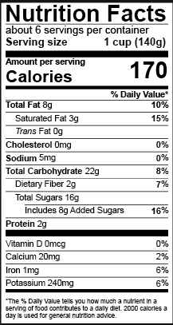
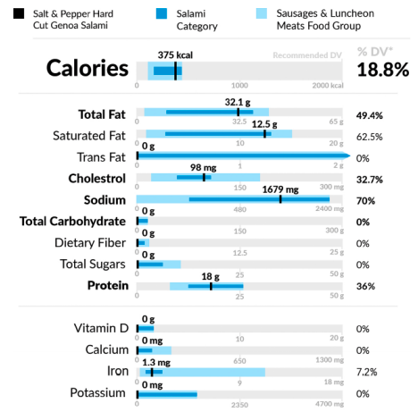
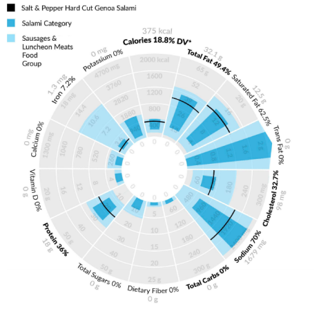
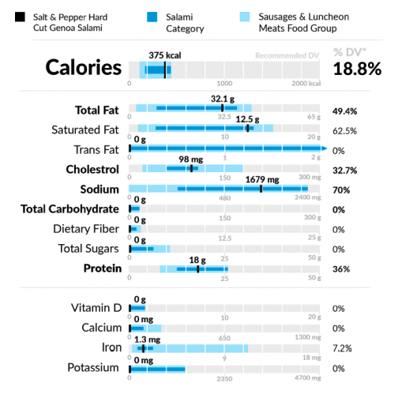

<h3> Eating with a Conscience: <h3/>
<h4> Toward a Visual and Contextual Nutrition Facts Label <h4/>

 There are a variety of food options in the market today available to the consumer causing the process of choosing goods that support the diet-conscious consumer’s goal of a well balanced diet quite complex. People have grown increasingly conscious of their food choices and product selection in order to stay healthy and maintain a balanced diet. The variety of products and the varying levels of nutrients make it difficult for the consumer to choose the products most suitable for their goals. The Food and Drug Administration (FDA) regulates the design of the nutrition label found on the back of most food items and consistently tries to improve the design of the label to improve consumer’s comprehension. The author’s of this paper have designed a new visual nutrition facts label with the bullet graph as the design foundation in order to assist consumers in making suitable choices by displaying the level of food in a nutrient product in the context of other similar food items and their nutrient levels. Refer to the standard FDA label and the new visual nutrition label designs below: 

 When looking at the current FDA designed nutrition label consumers tend to confuse computations and poorly estimate the contribution a particular product has on their daily nutrient requirement. The updated visual nutrition label is designed to assist consumers in understanding the level of individual nutrients in a particular food in comparison to other similar food products. The new design assists consumers in understanding whether there exist alternatives to their food product with a higher or lower nutrient content that would serve as a better option for the consumer’s particular nutritional goals. The authors hypothesize that the new visual representation of the food label will assist consumers in calculating more accurate computations regarding nutritional value of a particular food item. The authors hope to maintain the core design guidelines mandated by the FDA whilst adding a visual element to the nutrition label to increase consumer comprehension of nutritional value. The goal of the visual nutrition label is to allow consumers to easily be able to see a food’s nutrient levels, while also being able to compare the food among a range of similar foods. Refer to the images below for the linear and radial updated designs of the label: 

 Data was sourced from the US FDA database of food. The database contains a list of most food products sold in the US along with their nutrient levels and also categorizes the food into a sub-category and broader category. Authors calculated the upper bound and lower bound of all nutrient levels in a single serving within both a food category and sub-category in order to create a range for each nutrient within different categories. 

 Designers chose to use a modified bullet graph in order to represent a single nutrient quantity along with a range of other food items in a similar category so consumer’s are able to draw an accurate comparison of their product of choice against other options. A black marker is used to mark the food nutrients within the product itself and 2 colored bars are used to represent the range of nutrients within the product’s category and sub-category. Nutrient values that exceed the daily recommended limit are shown using a pointed arrow at the end of the bullet graph range bars. Author’s base this design facet off the principle that user’s find it easier to comprehend nutrient values within food products when they are shown as a percentage of daily value rather than the value itself. Authors present both a linear and radial layout where bullet graphs show nutrient value in accordance with the order and font size specified by the FDA. Authors conducted pilot studies of the newly redesigned labels and concluded that the linear redesigned label with bullet graphs were favored over the standard FDA label. Pilot test results showed that user’s still preferred the standard label over the radial design. Authors also conducted pilot tests of unit encoding within linear graphs and determined there weren’t any significant differences in user experience when presented with continuous vs discrete unit encodings and ranges on the bullet graph. Authors believe  discrete unit encoding would allow consumers to better comprehend the nutrient value of a particular product as the encoding breaks down the scale into 10 smaller units on the graph however, this may make comprehension of range approximation more difficult as ranges begin and end somewhere within each of the smaller unit ranges. Refer to the label below for the proposal of discrete unit encoding: 

 Author’s new design shows that a graphical representation of nutrient values on the product label may help to heighten consumer’s comprehension of nutrient values of their products of choice. 
